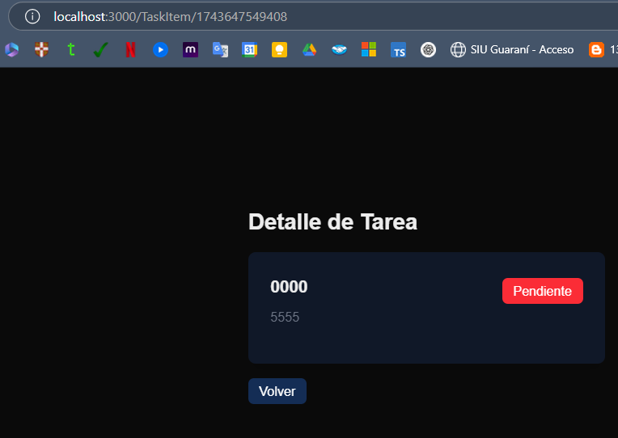

# forRIT- FORMAR Challenge

## Tabla de contenidos:

1. **[Objetivo](#objetivo)**
1. **[Tecnologías usadas](#tecnologías-usadas)**
1. **[Instalación de la base de datos](#instalación-de-la-base-de-datos)**
1. **[¿Cómo instalar el proyecto?](#cómo-instalar-el-proyecto)**
1. **[Rutas](#rutas)**
1. **[Imagenes](#imagenes)**

## Objetivo:

Crear una aplicación básica de lista de tareas que demuestre conocimientos fundamentales de Git, JavaScript, Node.js y React.

## Tecnologías usadas

<p align="left">
<!–– Next ––>
<a href="https://nextjs.org/" target="_blank" data-bs-toggle="tooltip" title="Next.js"> </a>
<!–– NODE JS ––>
<a href="https://img.shields.io/badge/Node.js-339933?style=for-the-badge&logo=nodedotjs&logoColor=white" target="_blank" data-bs-toggle="tooltip" title="node js"> </a>
<!-- EXPRESS -->
<a href="https://developer.mozilla.org/es/docs/Learn/Server-side/Express_Nodejs/Introduction" alt="Express Js" data-bs-toggle="tooltip" title="EXPRESS" ></a>
<!–– TAILWIND ––>
<a href="https://tailwindcss.com/" target="_blank" data-bs-toggle="tooltip" title="tailwind"> </a>
<a href="https://eslint.org/" target="_blank" data-bs-toggle="tooltip" title="EsLint"> </a>

  </p>
  
***

### ¿Cómo instalar el proyecto?

#### Desde la terminal:

- Clonar el proyecto:
````
git clone https://github.com/LorenaCoheneBaez/forIT-challenge.git
````
### Es necesario instalar las dependencias en las dos carpetas del proyecto.

***
***
### **Carpeta backend**

- Ingresar a la carpeta del proyecto: 
````
cd backend
````
### Agregar archivo .env En la raíz de la carpeta: 
- En el archivo agregar: 
````
PORT=5000
````

- Para instalar las dependencias correr: 
````
npm install
````
### Levantar el servidor de la Api: 
````
npm run dev
````
### Endpoints de la Api:

***
*Tareas (GET):*
- Listado "http://localhost:5000/api/tasks"

- Detalle "http://localhost:5000/api/tasks/:id"

*Tareas (POST):*
- Agregar "http://localhost:5000/api/tasks/add"

*Tareas (DELETE):*
- Eliminar "http://localhost:5000/api/tasks/:id"

*Tareas (PUT):*
- Editar "http://localhost:5000/api/tasks/:id"

***
### **Carpeta frontend**

- Ingresar a la carpeta del proyecto: 
````
cd frontend
````
- Para instalar las dependencias correr: 
````
npm install
````
### Agregar archivo .env En la raíz de la carpeta: 
- En el archivo agregar: 
````
NEXT_PUBLIC_API_URL=http://localhost:5000/api/tasks
````

### Levantar el servidor de la Api: 
````
npm run dev
````

***

## Rutas:

|Página|Ruta|
|--------|--------|
|   Home    |   http://localhost:3000|
|    Listado    |    http://localhost:3000/TaskList    |
|   Crear tarea    |    http://localhost:3000/TaskForm    |
|    Editar tarea   |    http://localhost:3000/TaskForm  |
|    Detalle de tarea    |   http://localhost:3000/TaskItem/:id    |


## Imagenes:




                                          